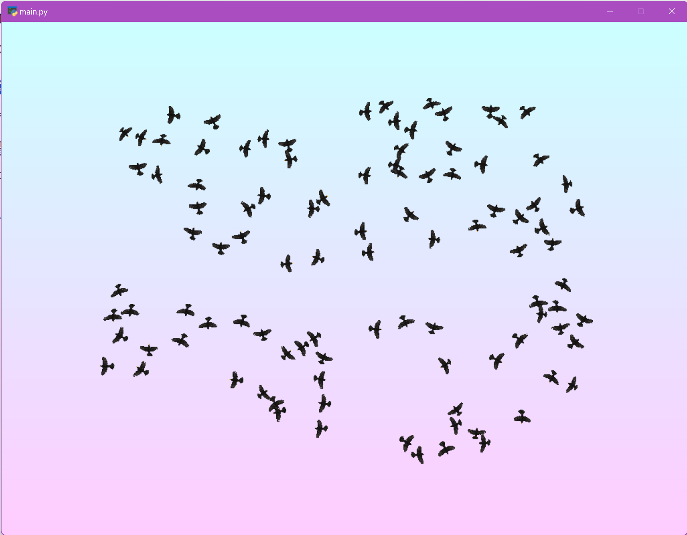
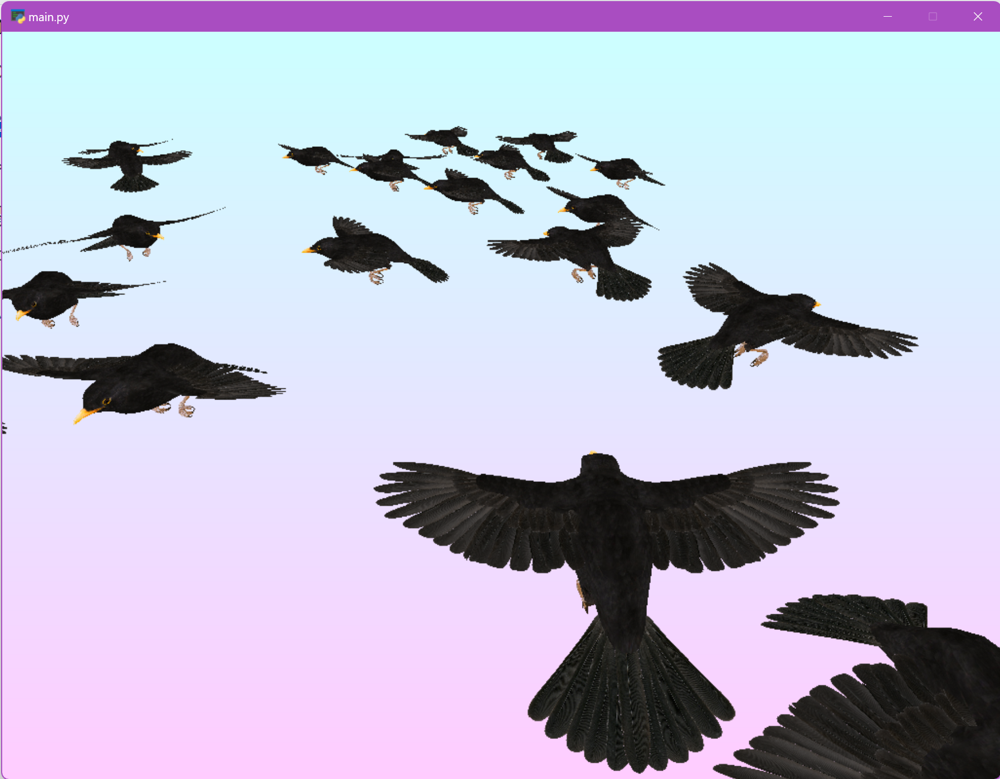

# Boids

Por [Eduardo Graells-Garrido](http://datagramas.cl) para el curso Computación Gráfica y Modelamiento del [Departamento de Ciencias de la Computación, Universidad de Chile](http://dcc.uchile.cl).

Este repositorio contiene una implementación de [BOIDS](https://en.wikipedia.org/wiki/Boids) (Bird-oid objects de [Craig Reynolds](http://www.red3d.com/cwr/)). Esa implementación proviene de la biblioteca de simulación `mesa`. La simulación se ve en tiempo real utilizando OpenGL a través de `pyglet`. 

La visualización utiliza el modelo 3D de un pajarito en la carpeta `assets`. Se carga utilizando la biblioteca `trimesh`. El modelo 3D no es abierto y solo está disponible para les integrantes del curso (lo pueden bajar de U-Cursos).

Para crear un entorno que contiene todo lo necesario para ejecutar este programa, debes ejecutar:

`mamba env create -f environment.yml`

Para tener el comando `mamba` te recomiendo instalar [Miniconda](https://docs.conda.io/en/latest/miniconda.html) y luego mamba (`conda install mamba`).

El programa se ejecuta como `python main.py` y de momento tiene dos maneras de interactuar:

- La tecla `P` pone en pausa la simulación.
- La tecla `V` cambia entre una vista superior y una vista en tercera persona detrás de un pajarito.

## Créditos

* El repositorio incluye código implementado por [Daniel Calderón](https://github.com/dantros) en versiones previas del curso.
* La implementación de BOIDS proviene del [repositorio de ejemplos de `mesa`](https://github.com/projectmesa/mesa/tree/main/examples/boid_flockers).

